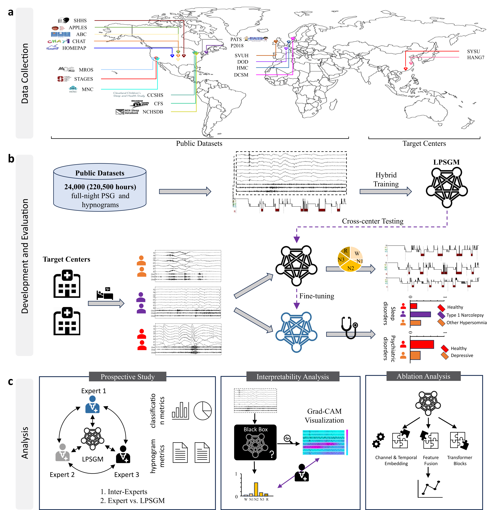
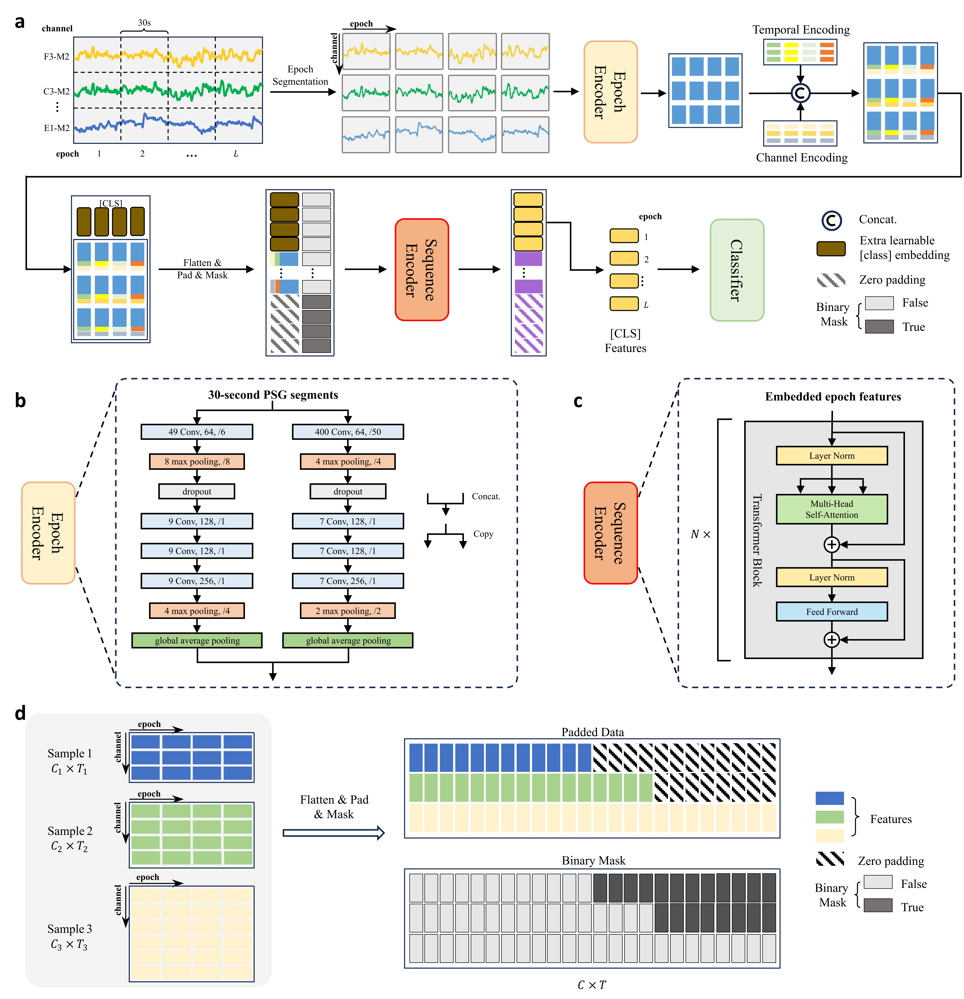

# LPSGM: A Unified Flexible Large PSG Model for Sleep Staging and Mental Disorder Diagnosis

## Overview



**Figure 1**: Overview of the LPSGM framework. Panel (a): Data harmonization schematizes the aggregation of 220,500 hours of PSG data from 16 public datasets and 2 independent clinical cohorts, spanning diverse geographic populations and recording protocols. Panel (b): Cross-center generalization outlines the training-evaluation pipeline: LPSGM is pre-trained on multi-center public datasets, validated for cross-domain sleep staging on two unseen private datasets, and fine-tuned for downstream tasks including sleep disorder diagnosis and MDD screening. Panel (c): Analytical validation details the study's three-pronged evaluation: (1) a prospective clinical trial benchmarking LPSGM against expert consensus, (2) interpretability analysis to decode decision-making patterns, and (3) ablation studies quantifying the contribution of key components.

## Architecture



**Figure 2**: Overall architecture of LPSGM. (a) LPSGM consists of an Epoch Encoder, Sequence Encoder, and Classifier, designed for both sleep staging and disorder diagnosis. (b) The Epoch Encoder employs a dual-branch CNN to extract local intra-epoch features from each 30-second PSG segment, using small and large convolutional filters to capture high- and low-frequency EEG features, respectively. (c) The Sequence Encoder consists of a series of N Transformer blocks to capture temporal dependencies across epochs in the sleep sequence. Each Transformer block consists of multi-head self-attention (MSA), feed-forward networks (FFN), and layer normalization (LN). (d) Padding and masking strategy implemented to handle samples with varying numbers of EEG channels, ensuring compatibility across different PSG datasets.

## Installation

We recommend using conda to create a new environment:

```bash
conda create -n LPSGM python=3.10.9

conda activate LPSGM

pip install -r requirements.txt
```

## Inference

If you only want to run inference on your own dataset without training, download our pre-trained weights from [Google Drive](https://drive.google.com/file/d/1Gg8mc2AC2Pt_sa4POp9kMZO92nW5XuLu/view?usp=sharing) and place them in the `weights/` directory.

Then modify the following parameters in `inference.py`:
- `edf_dir`: path to your EDF files
- `hypnogram_dir`: output path for hypnograms
- `channel_map_for_load_sig`: channel mapping based on your EDF channel names

Run inference with:

```bash
python inference.py
```

**Note**: Running local inference requires at least one GPU. If you don't have a GPU available, we provide a web demo at [https://lpsgm.cpolar.top](https://lpsgm.cpolar.top). The complete code for the web demo is in the `web_demo/` directory. However, due to the large file size of full-night EEG recordings and network transmission limitations, we strongly recommend running inference locally.

## Fine-tuning for Sleep Staging

As demonstrated in our paper, large-scale hybrid pre-training significantly improves sleep staging performance on downstream datasets. We provide scripts and pre-trained models for fine-tuning on your specific dataset.

**Step 1**: Prepare your dataset following the preprocessing scripts in the `preprocess/` directory. Place the preprocessed data in the `data/` directory.

**Step 2**: Modify the `prepare_data` function in `finetune.py` to implement your custom data loading and splitting logic.

**Step 3**: Configure the parameters in `finetune.sh`, then run:

```bash
bash finetune.sh
```

## Dataset Preparation

To reproduce the complete training process, download the following datasets:

### Sleep Staging Datasets

| Dataset | Link |
|---------|------|
| APPLES | [https://sleepdata.org/datasets/apples](https://sleepdata.org/datasets/apples) |
| DCSM | [https://sleepdata.org/datasets/dcsm](https://sleepdata.org/datasets/dcsm) |
| DOD | [https://zenodo.org/records/15900394](https://zenodo.org/records/15900394) |
| HMC | [https://physionet.org/content/hmc-sleep-staging/1.1/](https://physionet.org/content/hmc-sleep-staging/1.1/) |
| ISRUC | [https://sleeptight.isr.uc.pt/](https://sleeptight.isr.uc.pt/) |
| SVUH | [https://physionet.org/content/ucddb/1.0.0/](https://physionet.org/content/ucddb/1.0.0/) |
| P2018 | [https://physionet.org/content/challenge-2018/1.0.0/](https://physionet.org/content/challenge-2018/1.0.0/) |
| STAGES | [https://sleepdata.org/datasets/stages](https://sleepdata.org/datasets/stages) |
| ABC | [https://sleepdata.org/datasets/abc](https://sleepdata.org/datasets/abc) |
| NCHSDB | [https://sleepdata.org/datasets/nchsdb](https://sleepdata.org/datasets/nchsdb) |
| HOMEPAP | [https://sleepdata.org/datasets/homepap](https://sleepdata.org/datasets/homepap) |
| CHAT | [https://sleepdata.org/datasets/chat](https://sleepdata.org/datasets/chat) |
| CCSHS | [https://sleepdata.org/datasets/ccshs](https://sleepdata.org/datasets/ccshs) |
| CFS | [https://sleepdata.org/datasets/cfs](https://sleepdata.org/datasets/cfs) |
| MROS | [https://sleepdata.org/datasets/mros](https://sleepdata.org/datasets/mros) |
| SHHS | [https://sleepdata.org/datasets/shhs](https://sleepdata.org/datasets/shhs) |
| MASS (SS1 and SS3) | [https://borealisdata.ca/dataverse/MASS](https://borealisdata.ca/dataverse/MASS) |
| MESA | [https://sleepdata.org/datasets/mesa](https://sleepdata.org/datasets/mesa) |

### Sleep Disorder Diagnosis Dataset

| Dataset | Link |
|---------|------|
| MNC | [https://sleepdata.org/datasets/mnc](https://sleepdata.org/datasets/mnc) |

After downloading the datasets, run the preprocessing pipeline:

```bash
bash preprocess.sh
```

If some datasets are missing, comment out the corresponding commands in `preprocess.sh`.

## Training from Scratch

Configure the parameters in `train.sh`, then run:

```bash
bash train.sh
```

**Important**: To reduce memory overhead, the training process doesn't load all samples into memory. Instead, samples are cached in the directory specified by `--cache_root` and loaded dynamically during training. Make sure this directory has enough space to cache the segmented training samples (approximately 1TB as used in our paper).

## Fine-tuning for Sleep Disorder Classification

We provide fine-tuning code for binary/ternary classification of sleep disorders on the MNC dataset (see our paper for details). The code is in the `nar_cls/` directory.

**Step 1**: Preprocess the MNC dataset by running the MNC-related commands in `preprocess.sh`.

**Step 2**: Configure the parameters in `nar_cls/run_nar.sh`. The `--merge_NT1` parameter controls the classification task:
- **With `--merge_NT1`**: Binary classification (merges "Non-Narcolepsy Control" and "Other Hypersomnia" into "Non-T1 Control")
- **Without `--merge_NT1`**: Ternary classification (three separate classes)

**Step 3**: Run fine-tuning:

```bash
bash nar_cls/run_nar.sh
```

## Citation

If you use this code or results in your research, please cite:

```bibtex
@article{deng2024lpsgm,
  title={A unified flexible large psg model for sleep staging and mental disorder diagnosis},
  author={Deng, Guifeng and Niu, Mengfan and Rao, Shuying and Luo, Yuxi and Zhang, Jianjia and Xie, Junyi and Yu, Zhenghe and Liu, Wenjuan and Zhang, Junhang and Zhao, Sha and Pan, Gang and Li, Xiaojing and Deng, Wei and Guo, Wanjun and Zhang, Yaoyun and Li, Tao and Jiang, Haiteng},
  journal={medRxiv},
  year={2024},
  doi={10.1101/2024.12.11.24318815},
  url={https://www.medrxiv.org/content/10.1101/2024.12.11.24318815v3}
}
```
