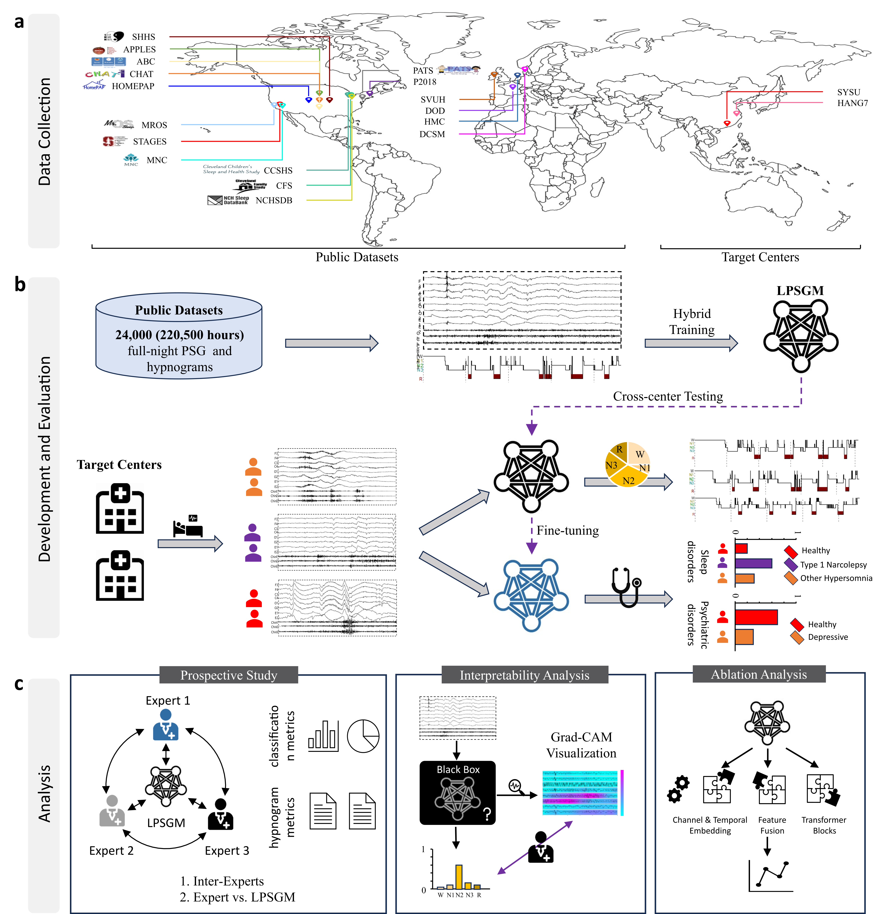
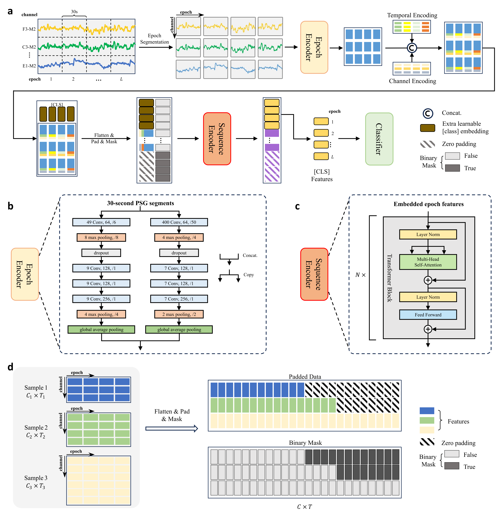

# LPSGM: A Unified Flexible Large PSG Model for Sleep Staging and Mental Disorder Diagnosis

## Overview



**Figure 1**: Overview of the LPSGM framework. Panel (a): Data harmonization schematizes the aggregation of 220,500 hours of PSG data from 16 public datasets and 2 independent clinical cohorts, spanning diverse geographic populations and recording protocols. Panel (b): Cross-center generalization outlines the training-evaluation pipeline: LPSGM is pre-trained on multi-center public datasets, validated for cross-domain sleep staging on two unseen private datasets, and fine-tuned for downstream tasks including sleep disorder diagnosis and MDD screening. Panel (c): Analytical validation details the study's three-pronged evaluation: (1) a prospective clinical trial benchmarking LPSGM against expert consensus, (2) interpretability analysis to decode decision-making patterns, and (3) ablation studies quantifying the contribution of key components.

## Architecture



**Figure 2**: Overall architecture of LPSGM. (a) LPSGM consists of an Epoch Encoder, Sequence Encoder, and Classifier, designed for both sleep staging and disorder diagnosis. (b) The Epoch Encoder employs a dual-branch CNN to extract local intra-epoch features from each 30-second PSG segment, using small and large convolutional filters to capture high- and low-frequency EEG features, respectively. (c) The Sequence Encoder consists of a series of N Transformer blocks to capture temporal dependencies across epochs in the sleep sequence. Each Transformer block consists of multi-head self-attention (MSA), feed-forward networks (FFN), and layer normalization (LN). (d) Padding and masking strategy implemented to handle samples with varying numbers of EEG channels, ensuring compatibility across different PSG datasets.

## Installation

We recommend using conda to create a new environment:

```bash
conda create -n LPSGM python=3.10.9

conda activate LPSGM

pip install -r requirements.txt
```

## Inference

If you only want to run inference on your own dataset without training, download our pre-trained weights from [Google Drive](https://drive.google.com/drive/folders/1eMuRaK4PelUAh9uG9DR2HXgExNmsoWhx?usp=sharing) and place them in the `weights/` directory.

Then modify the following parameters in `inference.py`:
- `edf_dir`: path to your EDF files
- `hypnogram_dir`: output path for hypnograms
- `channel_map_for_load_sig`: channel mapping based on your EDF channel names

**Important - Channel Mapping Configuration**: LPSGM uses 9 standard channels (F3, F4, C3, C4, O1, O2, E1, E2, Chin) and supports flexible configurations with 1-9 channels through a padding and masking mechanism. The `channel_map_for_load_sig` parameter maps these standard channel names to your EDF channel names. Two mapping types are supported: (1) **single channel mapping** for pre-referenced channels (e.g., `'C3': ('C3-M2',)`), and (2) **differential channel mapping** for computing differences between two electrodes (e.g., `'C3': (('C3', 'M2'),)`). Detailed configuration instructions with examples are provided in the comments above `channel_map_for_load_sig` in `inference.py`. Please read these instructions carefully to ensure correct channel mapping for your EDF files.

Run inference with:

```bash
python inference.py
```

**Note**: Running local inference requires at least one GPU. If you don't have a GPU available, we provide a web demo at [https://lpsgm.cpolar.top](https://lpsgm.cpolar.top). The complete code for the web demo is in the `web_demo/` directory. However, due to the large file size of full-night EEG recordings and network transmission limitations, we strongly recommend running inference locally.

## Fine-tuning for Sleep Staging

As demonstrated in our paper, large-scale hybrid pre-training significantly improves sleep staging performance on downstream datasets. We provide scripts and pre-trained models for fine-tuning on your specific dataset.

**Step 1**: Prepare your dataset following the preprocessing scripts in the `preprocess/` directory. Place the preprocessed data in the `data/` directory.

**Step 2**: Modify the `prepare_data` function in `finetune.py` to implement your custom data loading and splitting logic.

**Step 3**: Configure the parameters in `finetune.sh`, then run:

```bash
bash finetune.sh
```

## Dataset Preparation

To reproduce the complete training process, apply for and download the following datasets from their respective sources:

### Sleep Staging Datasets

| Dataset | Link |
|---------|------|
| APPLES | [https://sleepdata.org/datasets/apples](https://sleepdata.org/datasets/apples) |
| DCSM | [https://sleepdata.org/datasets/dcsm](https://sleepdata.org/datasets/dcsm) |
| DOD | [https://zenodo.org/records/15900394](https://zenodo.org/records/15900394) |
| HMC | [https://physionet.org/content/hmc-sleep-staging/1.1/](https://physionet.org/content/hmc-sleep-staging/1.1/) |
| ISRUC | [https://sleeptight.isr.uc.pt/](https://sleeptight.isr.uc.pt/) |
| SVUH | [https://physionet.org/content/ucddb/1.0.0/](https://physionet.org/content/ucddb/1.0.0/) |
| P2018 | [https://physionet.org/content/challenge-2018/1.0.0/](https://physionet.org/content/challenge-2018/1.0.0/) |
| STAGES | [https://sleepdata.org/datasets/stages](https://sleepdata.org/datasets/stages) |
| ABC | [https://sleepdata.org/datasets/abc](https://sleepdata.org/datasets/abc) |
| NCHSDB | [https://sleepdata.org/datasets/nchsdb](https://sleepdata.org/datasets/nchsdb) |
| HOMEPAP | [https://sleepdata.org/datasets/homepap](https://sleepdata.org/datasets/homepap) |
| CHAT | [https://sleepdata.org/datasets/chat](https://sleepdata.org/datasets/chat) |
| CCSHS | [https://sleepdata.org/datasets/ccshs](https://sleepdata.org/datasets/ccshs) |
| CFS | [https://sleepdata.org/datasets/cfs](https://sleepdata.org/datasets/cfs) |
| MROS | [https://sleepdata.org/datasets/mros](https://sleepdata.org/datasets/mros) |
| SHHS | [https://sleepdata.org/datasets/shhs](https://sleepdata.org/datasets/shhs) |
| MASS (SS1 and SS3) | [https://borealisdata.ca/dataverse/MASS](https://borealisdata.ca/dataverse/MASS) |
| MESA | [https://sleepdata.org/datasets/mesa](https://sleepdata.org/datasets/mesa) |

### Sleep Disorder Diagnosis Dataset

| Dataset | Link |
|---------|------|
| MNC | [https://sleepdata.org/datasets/mnc](https://sleepdata.org/datasets/mnc) |

After downloading the datasets, run the preprocessing pipeline:

```bash
bash preprocess.sh
```

If some datasets are missing, comment out the corresponding commands in `preprocess.sh`.

## Training from Scratch

Configure the parameters in `train.sh`, then run:

```bash
bash train.sh
```

**Important**: To reduce memory overhead, the training process doesn't load all samples into memory. Instead, samples are cached in the directory specified by `--cache_root` and loaded dynamically during training. Make sure this directory has enough space to cache the segmented training samples (approximately 1TB as used in our paper).

## Narcolepsy Classification

We provide a fine-tuning pipeline on the MNC dataset for 3-class narcolepsy classification (Non-narcolepsy Control / Type 1 Narcolepsy / Other Hypersomnia). The code lives in the `nar_cls/` directory and is built on top of the shared `cls_core/` module.

**Step 1**: Preprocess the MNC dataset by running the MNC-related commands in `preprocess.sh` so that subject-level NPZ files appear under `data/MNC-{CNC,DHC,FHC,IHC,KHC,SSC}/`. Each NPZ carries a `Diagnosis` integer field (0 = Non-narcolepsy Control, 1 = Type 1 Narcolepsy, 2 = Other Hypersomnia) used as the subject-level label. Place the pretrained weights under `weights/`.

**Step 2**: Run the full pipeline from the repository root:

```bash
bash nar_cls/run_nar.sh
```

The script runs the same uniform two-stage pipeline as `osa_cls`: (1) 5-fold stratified cross-validation with 25% of each fold's training set held out for validation (60/20/20 train/val/test split per fold) to fine-tune the pooled LPSGM backbone, and (2) frozen-backbone linear probing with a class-weighted logistic regression applied directly to each fold's test split. Per-fold outputs (checkpoint, test metrics, linear-probing metrics, predictions, TensorBoard logs) are written to `run_nar/fold{N}/`. The shared training and evaluation logic lives in `cls_core/`.

## Grad-CAM Visualization

We provide a Grad-CAM + Guided Backpropagation pipeline for visualizing which PSG signal regions contribute most to LPSGM's sleep stage predictions. The code lives in the `gradcam/` directory and reuses the main `model/` module without duplication. The default configuration targets the MASS-SS1/SS3 datasets as a reproducible public-data example; other recordings can be supported by providing a new channel map in `gradcam/channel_maps.py` and, if the annotation format differs from EDF+, a matching annotation parser in `gradcam/utils.py`.

**Step 1**: Preprocess MASS-SS1/SS3 following `preprocess/MASS-SS1-SS3.py` so that subject-level EDF pairs (`{sub_id} PSG.edf` and `{sub_id} Base.edf`) are available under a source directory. Place the pretrained weights under `weights/`.

**Step 2**: Run the pipeline from the repository root:

```bash
python -m gradcam.pipeline \
    --src-root <path_to_mass_edf_root> \
    --weights weights/ched32_seqed64_ch9_seql20_block4.pth \
    --output-root gradcam_output \
    --stages save_raw,gradcam,guided,render
```

The pipeline runs four stages: (1) LPSGM inference with raw signal caching, (2) dual-branch Grad-CAM at the last convolutional layer of each Epoch Encoder branch, (3) Guided Backpropagation, and (4) per-epoch PNG visualizations fusing Grad-CAM with guided saliency. See `gradcam/README.md` for the aggregation formula and per-file walkthrough.

## OSA Severity Classification

We provide a fine-tuning pipeline on the APPLES dataset for binary OSA severity classification (Severe vs Non-severe, AHI-based). The code lives in the `osa_cls/` directory and is built on top of the shared `cls_core/` module, which provides the pooled LPSGM classifier, the uniform k-fold training protocol, and a frozen-backbone linear probing evaluator used by every downstream disorder-classification task.

**Step 1**: Preprocess the APPLES dataset using `preprocess/APPLES.py` so that subject-level NPZ files appear under `data/APPLES/`. Place the pretrained weights under `weights/`. The binary OSA label file `preprocess/apples_osa_labels.csv` is already included in the repository.

**Step 2**: Run the full pipeline from the repository root:

```bash
bash osa_cls/run_osa.sh
```

The script runs a uniform two-stage pipeline: (1) 5-fold stratified cross-validation with 25% of each fold's training set held out for validation (60/20/20 train/val/test split per fold) to fine-tune the pooled LPSGM backbone, and (2) frozen-backbone linear probing, where a single class-weighted logistic regression is fit on the fold's subject-level mean-pooled features and applied directly to the test split. Per-fold outputs (checkpoint, test metrics, linear-probing metrics, predictions, TensorBoard logs) are written to `run_osa/fold{N}/`. The shared training and evaluation logic lives in `cls_core/`.

## Depression Classification

We provide a fine-tuning pipeline on the APPLES dataset for binary depression classification (Depressed vs Non-depressed). The code lives in the `dep_cls/` directory and is built on top of the shared `cls_core/` module, using the same uniform two-stage pipeline as `osa_cls` and `nar_cls`.

**Step 1**: Preprocess the APPLES dataset using `preprocess/APPLES.py` so that subject-level NPZ files appear under `data/APPLES/`. Place the pretrained weights under `weights/`. The binary depression label file `preprocess/apples_dep_labels.csv` is already included in the repository (460 subjects: 327 Non-depressed, 133 Depressed; see the manuscript's Supplementary Methods for the label-derivation criteria that combine the self-reported `depressionmedhxhp` field with HAMD and BDI clinical scale scores).

**Step 2**: Run the full pipeline from the repository root:

```bash
bash dep_cls/run_dep.sh
```

Per-fold outputs (checkpoint, test metrics, linear-probing metrics, predictions, TensorBoard logs) are written to `run_dep/fold{N}/`. The shared training and evaluation logic lives in `cls_core/`.

## Citation

If you use this code or results in your research, please cite:

```bibtex
@article{deng2024lpsgm,
  title={A unified flexible large psg model for sleep staging and Brain disorder diagnosis},
  author={Deng, Guifeng and Niu, Mengfan and Rao, Shuying and Luo, Yuxi and Zhang, Jianjia and Xie, Junyi and Yu, Zhenghe and Liu, Wenjuan and Zhang, Junhang and Zhao, Sha and Pan, Gang and Li, Xiaojing and Deng, Wei and Guo, Wanjun and Zhang, Yaoyun and Li, Tao and Jiang, Haiteng},
  journal={medRxiv},
  year={2024},
  doi={10.1101/2024.12.11.24318815},
  url={https://www.medrxiv.org/content/early/2025/11/27/2024.12.11.24318815}
}
```
