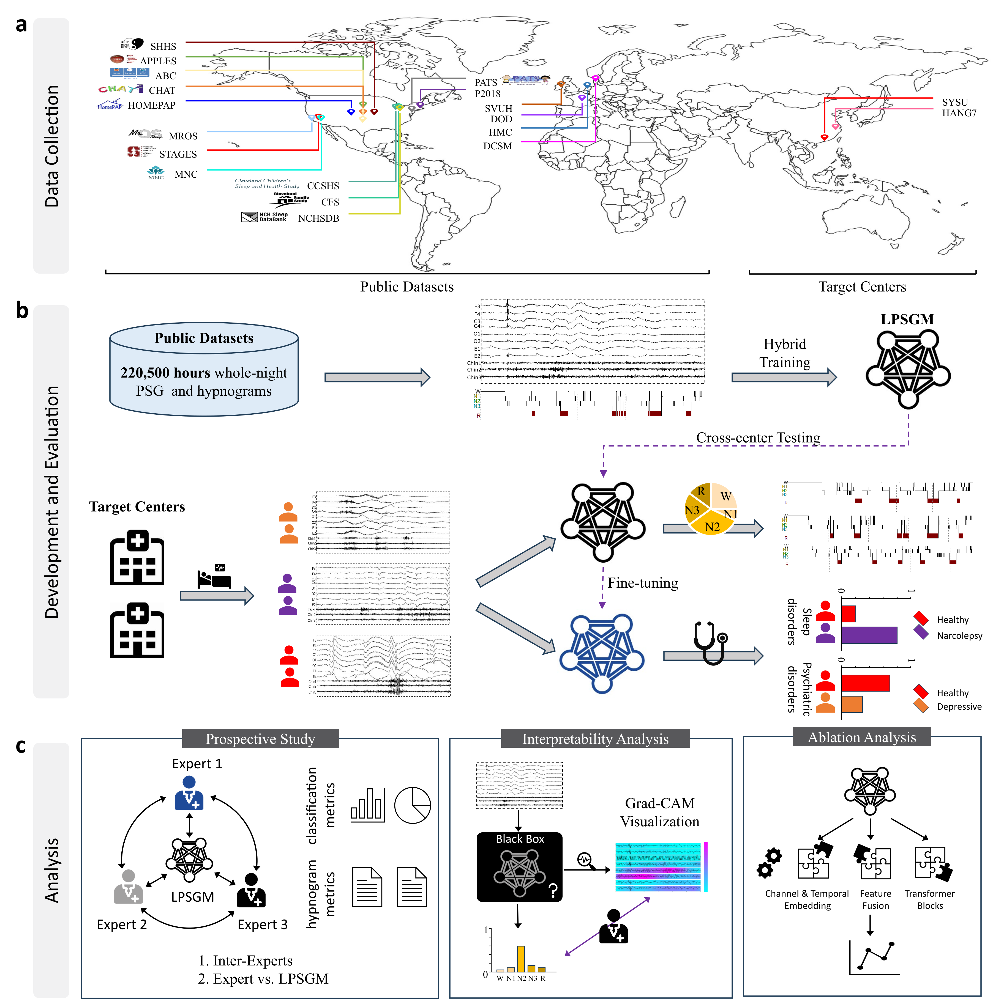
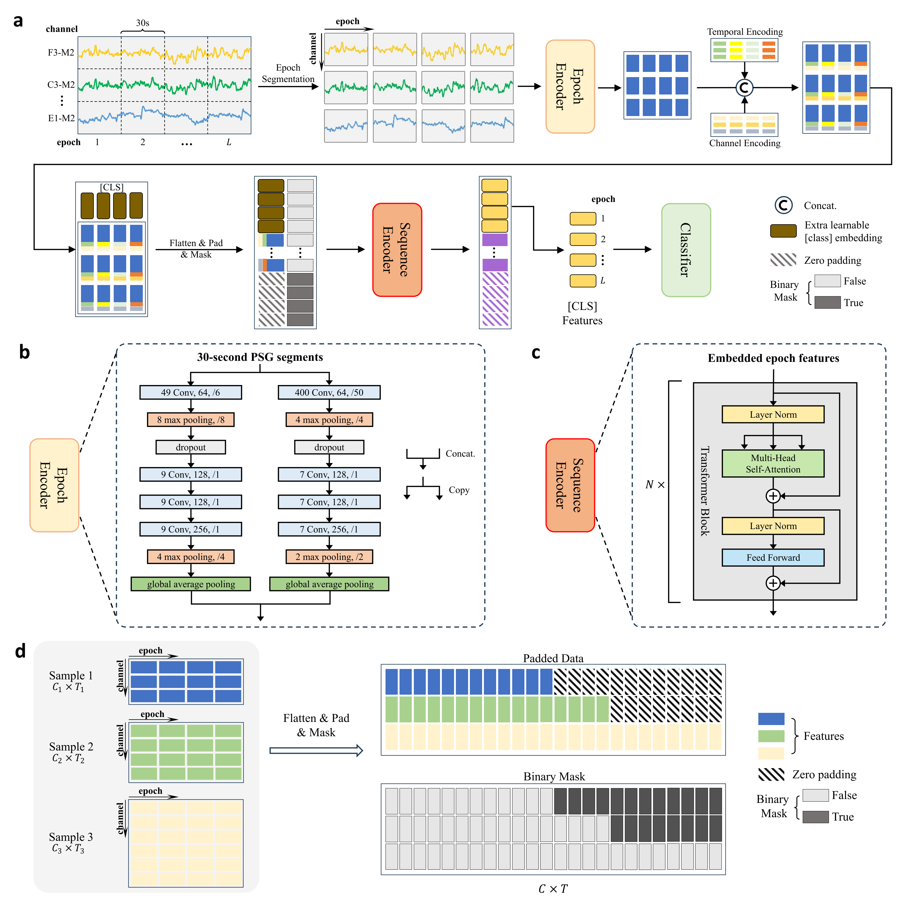

# LPSGM: A Unified Flexible Large PSG Model for Sleep Staging and Mental Disorder Diagnosis

## Overview



Fig. 1: Overview of the LPSGM framework for sleep staging and disorder diagnosis. Panel (a) illustrates the data collection process, which integrates 220,500 hours of polysomnography (PSG) data from 16 publicly available datasets and two target-center datasets, covering a diverse range of geographic regions and recording conditions. Panel (b) presents the development and evaluation pipeline, where LPSGM is trained on large-scale public datasets and evaluated for cross-center sleep staging on target-center data. The model is then fine-tuned for downstream applications, including narcolepsy diagnosis and depression detection. Panel (c) summarizes the research analyses conducted in this study, including a prospective clinical study to validate real-world performance, an interpretability analysis to examine model decision-making, and an ablation study to assess the contribution of key model components.

## Architecture



Fig. 5: Overall architecture of LPSGM. (a) LPSGM consists of an Epoch Encoder, Sequence Encoder, and Classifier, designed for both sleep staging and disorder diagnosis. (b) The Epoch Encoder employs a dual-branch CNN to extract local intra-epoch features from each 30-second PSG segment, using small and large convolutional filters to capture high- and low-frequency EEG features, respectively. (c) The Sequence Encoder consists of a series of N Transformer blocks to capture temporal dependencies across epochs in the sleep sequence. Each Transformer block consists of multi-head self-attention (MSA), feed-forward networks (FFN), and layer normalization (LN). (d) Padding and masking strategy implemented to handle samples with varying numbers of EEG channels, ensuring compatibility across different PSG datasets.

## Citation

If you use the code or results in your research, please consider citing our work at:

```
@article{deng2024lpsgm,
  title={A unified flexible large psg model for sleep staging and mental disorder diagnosis},
  author={Deng, Guifeng and others},
  journal={medRxiv},
  year={2024},
  doi={10.1101/2024.12.11.24318815},
  url={https://www.medrxiv.org/content/10.1101/2024.12.11.24318815v2},
}
```
