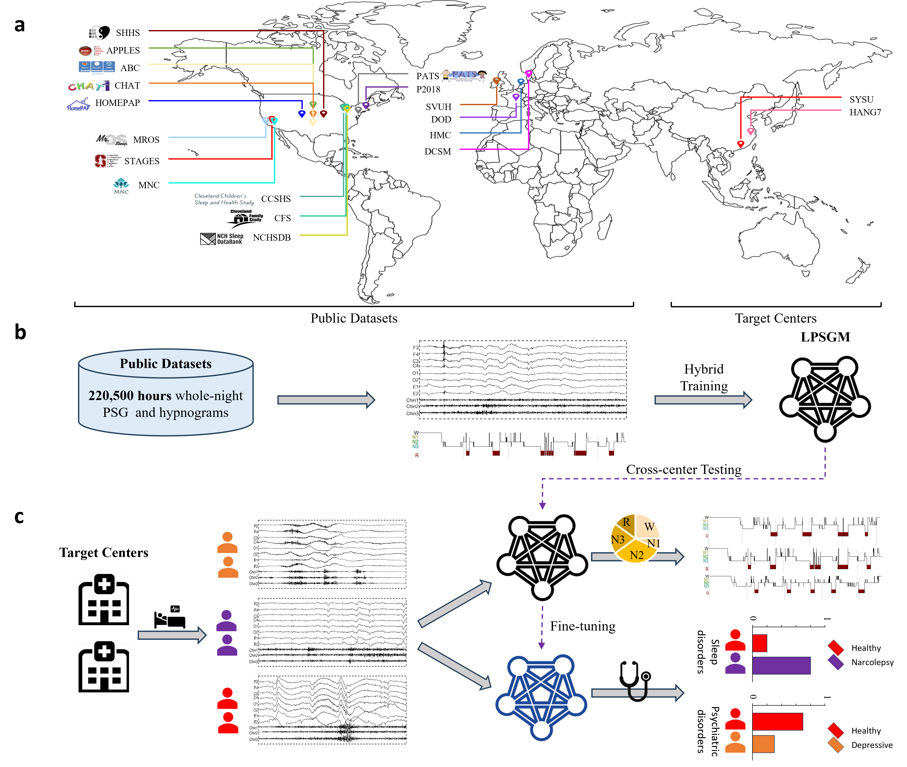
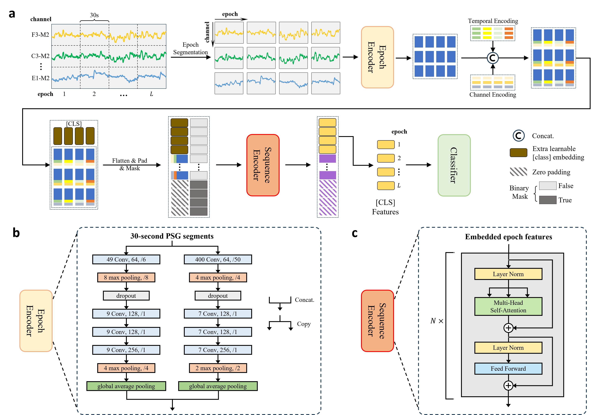

# LPSGM: A Unified Flexible Large PSG Model for Sleep Staging and Disorder Diagnosis

## Overview

Overview of the LPSGM framework for sleep staging and disorder diagnosis. (a) Geographic distribution of public and target datasets used in this study. (b) LPSGM training pipeline. (c) Cross-center testing and downstream disorder diagnosis.

## Architecture

(a) The overall architecture of LPSGM, which integrates the Epoch Encoder, Sequence Encoder, and Classifier for both sleep staging and disorder diagnosis tasks. (b) The Epoch Encoder uses a dual-branch CNN to extract local features from each 30-second epoch of PSG data. (c) The Sequence Encoder consists of a series of N Transformer blocks to capture temporal dependencies across epochs in the sleep sequence. 

## Code Availability

The complete code will be released upon acceptance of the paper.
